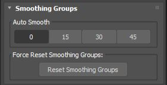

Smoothing Groups:

A quick way to assign Smoothing groups to selected objects.

Reset Smoothing groups uses a “applying meshsmooth with iteration 0” workaround to overcome a potential bug in Max that prevents the application resetting smoothing groups on objects sometimes.