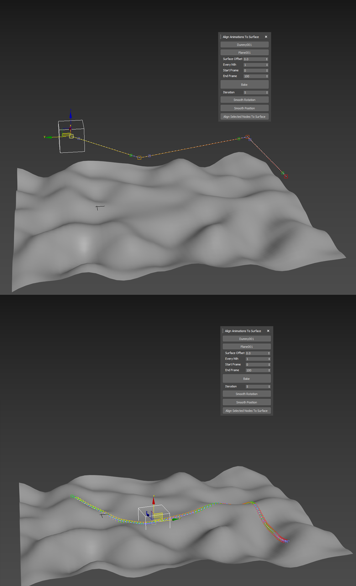

Align Animation to Surface:

Takes an animated object and auto aligns/bakes it to follow a given surface.

This is useful to quickly create rough CAT path nodes on uneven surfaces by animators while not having to worry about trying to match the surface accurately only to polish the movement afterwards.

Note: Some extreme 90 degree angles may create rotation issues that would require manual clean up on the keyframes after the alignment. 

## How To Use:
1. pick the node you want to align
2. pick the surface you want to project your point onto
3. define the offset from the surface (0.0 by default)
4. define the steps to bake (default is set to 1 which means all frames)
5. define the animation range (start and end frame)
6. Press "Bake"
### Use the rest if you want to smooth out the results
1. define the iteration amount
2. press "Smooth Rotation" to use average value between frames
3. Use "Smooth Position" to use average value between frames
### Use this if you want to project a bunch of nodes onto the surface all together (no animation)
1. select the nodes you want (e.g., projecting footsteps on the surface)

