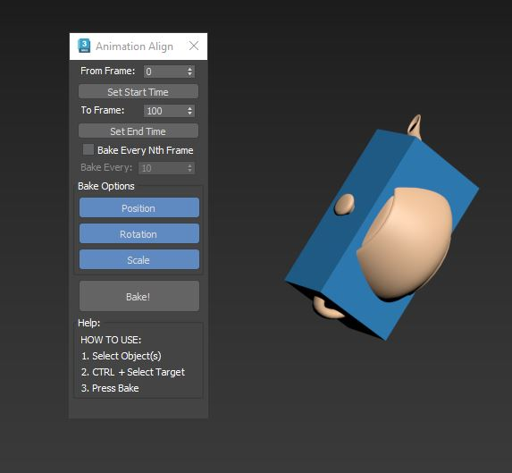

Animation Align:

Select the object that needs to be Aligned, then CTRL select the target object and press Bake.

The script will bake and key all selected transforms to align to the target object.
