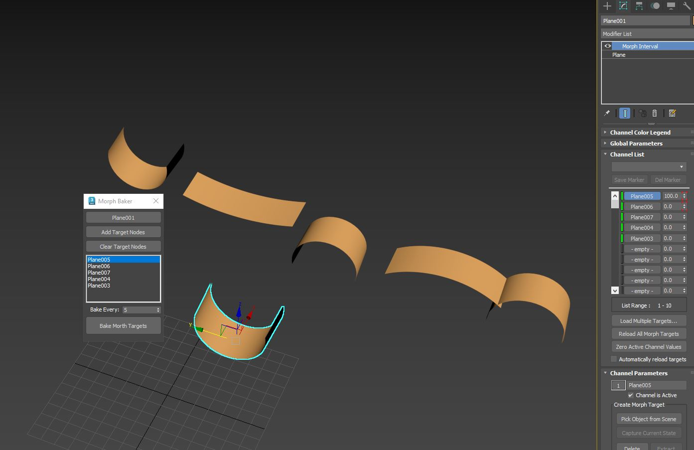

Morph Baker:

This tool takes  a list of selected morph targets for a mesh and automatically creates the Morph stack with animated keyframes.

Useful if you need to export such animations to game engines, can also be used as an alternative to vertex animation (albeit without any of its poly count limitations). 

Bake every (Frame here): Simply tells the script to key at every X frame. Default is 5 so it will set a key for every 5 frames.
