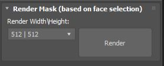

Render Masks:

A fast way to render out clean masks based on face selections. Useful if you want to use the masks in game engines or export them to Substance/Photoshop for further editing with layers.

Note: This converts the selected object to edit poly and changes the production renderer to Scanline in order to render out the Frame.

Use the Render Width/Height Parameter to change the resolution of your image.
