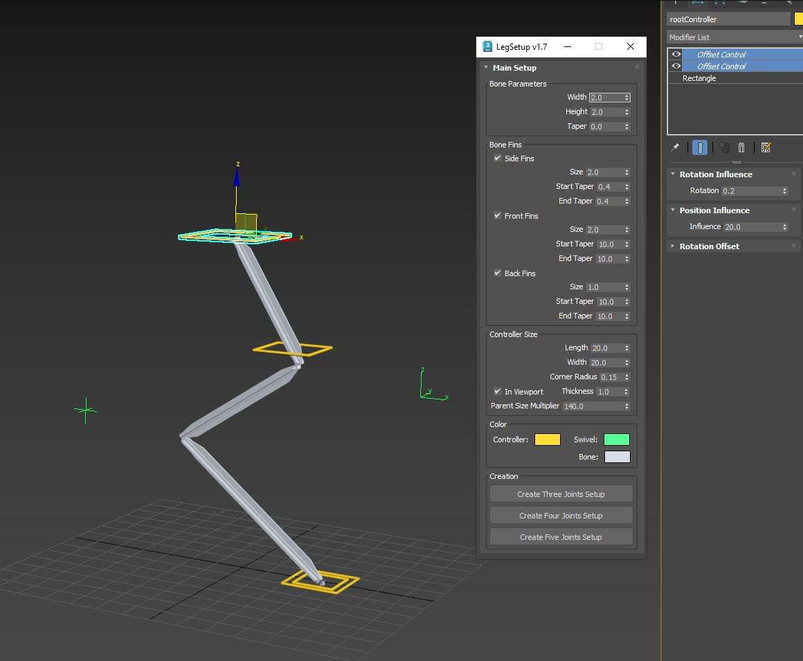

Rig: Leg Setup

This Rig Creator was particularly created to help with Four joint setups for specific Leg Rigs. However three and five joint setups can also be created.

The Rig is self explanatory, simply move the orange point helpers to shape the bones, and hit the create button.

The four joint setup has additional controls for various “influence amounts” in relation to upper joints under the modifier panel.
