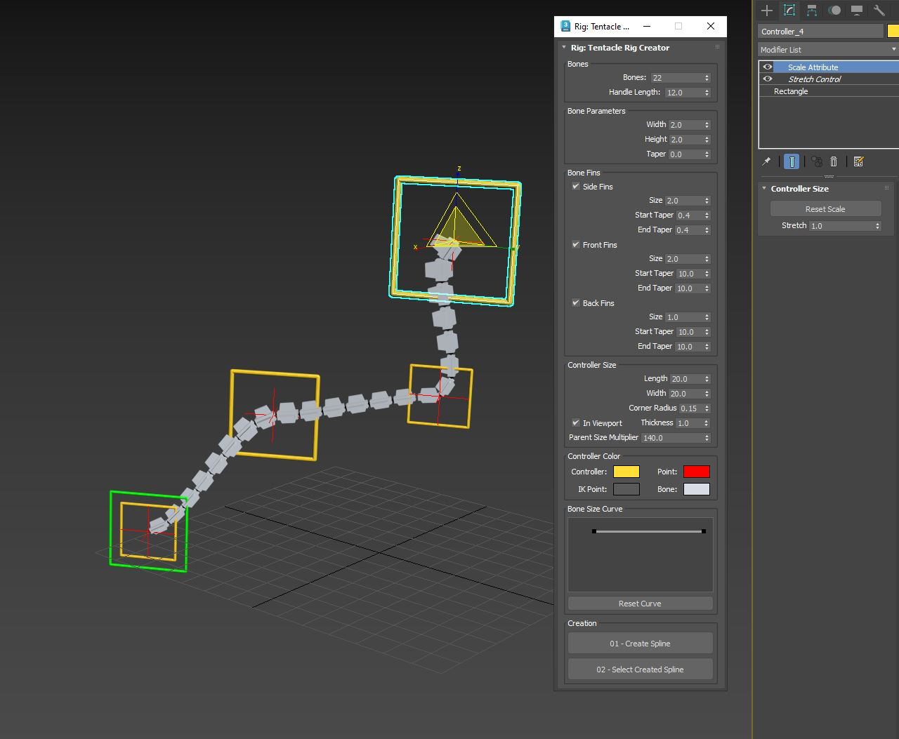
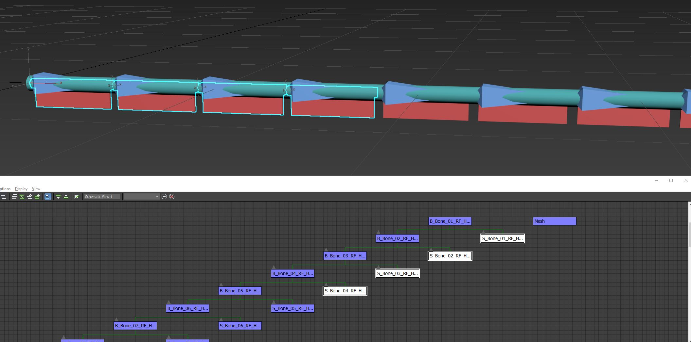

Rig: Tentacle setup

This tool helps in the creation of Tentacle Rigs.

The Bone size and Fins are self explanatory and standard Bone setups in Max.
The controller Size and Color determine the Look of the controller.
Bone Size Curve: Optionally used to determine scale of the bones and controllers from the start.
Create spline: Use this first to create your spline. 

(Hint: keep line point count as low as possible to make animation process more manageable, in practice a number of 3 usually works well for most situations).
Select Created Spline: Use this to finally select the spline which is followed by the automated creation of the rig.

When a controller is selected, you may find under the modifier panel controls over the amount of "Stretchy bones" to use and another to reset the scale of the controllers. 

Usage hints.

1 - Controllers can be rotated, positioned and scaled to determine shape of the tentacle. 
2 - Make sure to move, organize and keep the newly created bones and controllers in the Layer manager under respective layers. Its best to have a new layer selected before the creation of the Rig, so all elements of the Rig end up in that particular layer to avoid confusion with other elements in your scene.
3 - Yellow controllers control the main movement and posing of the Tentacle while Scaling the Red cross Controllers determine the Tangent Curve of the tentacles.
4 - Be mindful never to Scale the controllers Non-uniformly.

UE4 Export. 

In order for the stretchy bones + Bone scaling to work correctly in UE4, an additional setup of “Exportable Bones” is required over the current rig, 
the approach to get it running in the engine is a two phase process which requires multiple constraints and multiple bone hierarchies on the newly exported bones which is unique for stretchy bones to work correctly and scale accordingly in the engine with the tentacle rig. 

Note: We hope to update the script in the future to enable out of the box creation for these bones over the current setup.

In the Meanwhile we hope the information above can be helpful to setup such a rig.

The Max file in folder contains a simple "exportable bones" setup for UE.

Study the hierarchy arrangement here. Only the bones with "S_" under their prefix is skinned to the mesh. The "B_" bones act as the drivers of those bones and are the ones that are either "Link constraint" or "Pos/Orientation/Scale Constraint" to the Rig bones.
