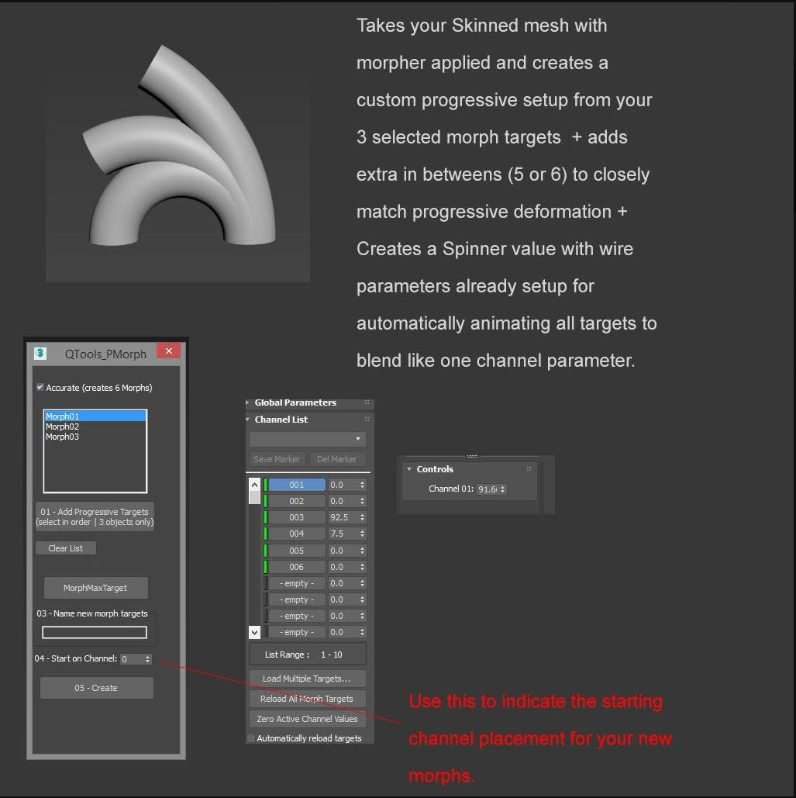

Progressive morph setups from Max or other such methods of in-between morphs from 3d applications are incompatible with game-engines.

This Script helps with rigging, setup and export of progressive morphs from Max to Real time engines such as Unreal or Unity. 

Internally it creates the traditional progressive morph setup in Max from your 3 targets and does the extra in-betweens for you (5 or 6 depending on the setting you choose, this process is necessary to more closely match the progressive morph output's interpolation method of Max), it sets them up on the morph channels of your target mesh and more importantly creates a wire setup exposed by a helper object in the scene with a single spinner that goes through all the channels for you. This way you can have your custom UI linked to this one spinner in order to animate all morphs automatically to simulate the traditional single channel setup of max's progressive morpher.
The file comes with a simple example scene to test it out.

Usage:
1 - Select and add 3 progressive morph targets (must be selected in order as you would for the usual progressive in Max, ex: 01, 02, 03).
2 - Select your main final target mesh which has morpher modifier on.
3 - Type in the name of the new Morph targets.
4 - You can decide on which channel number you wish the morph targets to start being applied, ex. Channel number 10 will start applying 5 (or 6 if you choose "accurate mode") of the newly generated morph targets on Channels (10 to 15).
5 - Hit create.

Limitations:

This is a script made quickly according to our requirements and is provided as is (make sure to backup your scene), some of the limitations are:

1 - You can only add three progressive morph targets to the script.
2 - Creates 5 or 6 final morph targets (not less not more).
3 - Make sure to restart the script with every use and have the modifier stack order setup on your target main mesh as the final clean one ex. (edit mesh - Morpher - Skin) with no naming changes done to the "morpher" Modifier.
