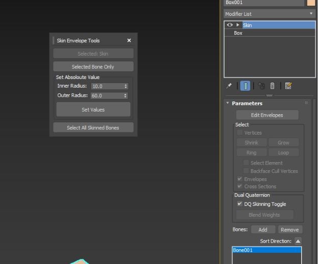

Skin tools:

A small Script that can help with Bone envelope adjustments as well as selecting all the skinned bones in the skin modifier, the latter being useful to create selection sets in case of loading/saving envelopes or transferring skin.

Usage:
Select the skinned mesh and then select the skin modifier and finally select bone/envelope to modify.