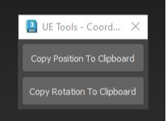

Max to UE Coordinates:

Useful tool to quickly copy and paste coordinates between objects in Max and Unreal Engine. It automatically adjusts the coordinates accordingly between Max and UE for compatibility purposes.

It takes into account all XYZ values together, you simply have to paste it once into the engine coordinates.
